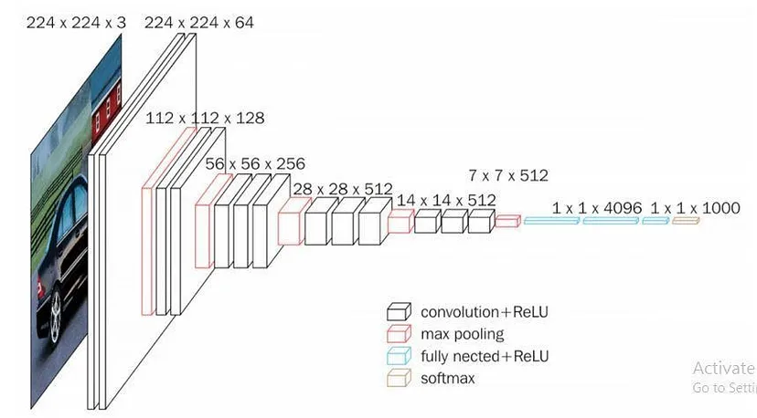

### Covid-19 Detection on Chest X-Ray Images Using CNN

#### Overview
This project aims to detect COVID-19 in chest X-ray images using a Convolutional Neural Network (CNN). The CNN model classifies images into three categories: 'Covid', 'Normal', and 'Pneumonia'. Leveraging the VGG-16 architecture for feature extraction, this project fine-tunes the pre-trained model to enhance its performance specifically for this classification task.

#### VGG-16 Model
VGG-16 is a well-known convolutional neural network model with 16 layers, designed by the Visual Graphics Group at the University of Oxford. It is trained on the ImageNet dataset and is known for its depth and simplicity. The architecture consists of multiple convolutional layers, which help in capturing intricate features from the images, making it ideal for tasks such as medical image classification.

#### Transfer Learning
In this project, transfer learning is applied using the VGG-16 model. Transfer learning involves using a pre-trained model on a new, but similar problem. This method is particularly useful when dealing with a limited dataset, as the pre-trained model has already learned to extract features that are generally useful for image classification.

#### Dataset
The dataset includes chest X-ray images categorized into three classes:

1. Covid: X-ray images of patients diagnosed with COVID-19.
2. Normal: X-ray images of healthy individuals.
3. Pneumonia: X-ray images of patients with pneumonia but not COVID-19.
These images are publicly available and have been curated to create a balanced dataset for training and evaluation purposes.

#### Methodology
##### Data Preprocessing: 
      The images are preprocessed to ensure uniformity in size and scale, and then divided into training and validation sets.
##### Feature Extraction: 
      The VGG-16 model, pre-trained on ImageNet, is used to extract features from the chest X-ray images.
##### Model Fine-Tuning: 
      The top layers of the VGG-16 model are fine-tuned, and additional fully connected layers are added to adapt the model for the specific classification task.
##### Training: 
      The modified model is trained on the preprocessed dataset, and performance metrics such as accuracy, precision, and recall are used to evaluate its effectiveness.
##### Evaluation: 
      The model's performance is assessed on a validation set to ensure its robustness and accuracy.

#### Results
The model demonstrates high accuracy in classifying chest X-ray images, making it a valuable tool for aiding in the diagnosis of COVID-19 and distinguishing it from other respiratory conditions like pneumonia. The use of VGG-16 and transfer learning significantly enhances the model's performance, particularly when working with limited data.

#### Significance
Early and accurate detection of COVID-19 through chest X-rays can significantly aid in timely treatment and containment efforts. This project showcases the potential of deep learning in medical diagnostics, providing a scalable and efficient solution for COVID-19 detection.

#### Future Work
Future improvements could include:

Incorporating larger and more diverse datasets.
Exploring other deep learning architectures.
Enhancing model interpretability to provide more insights into the decision-making process.
